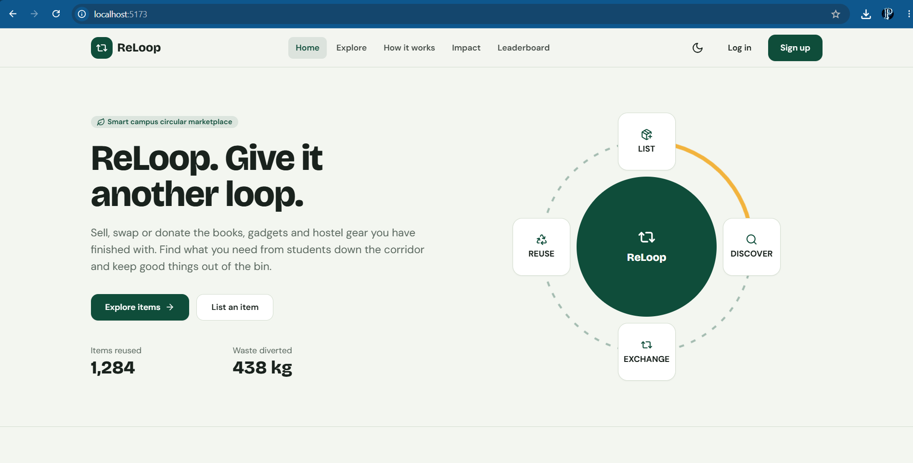
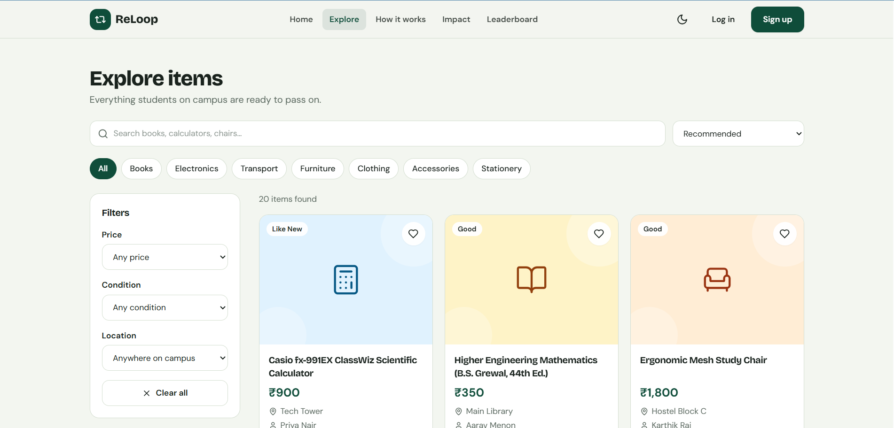
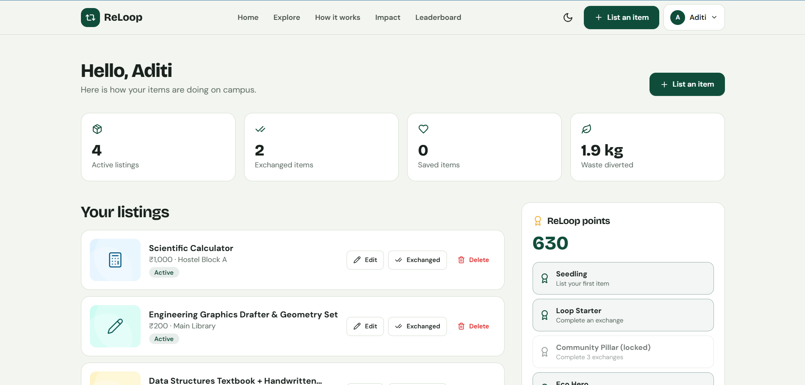
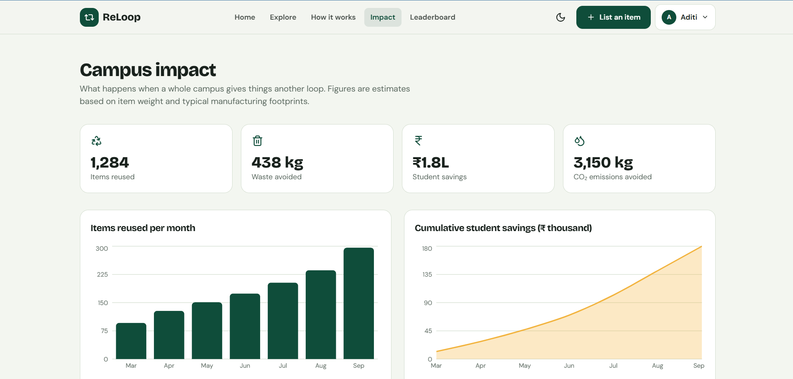
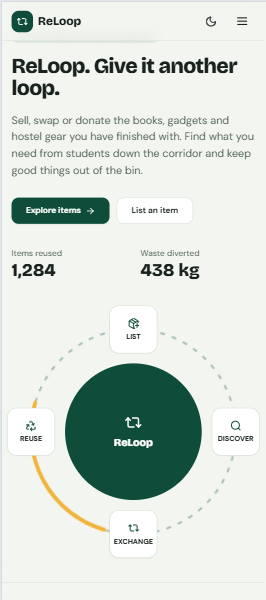
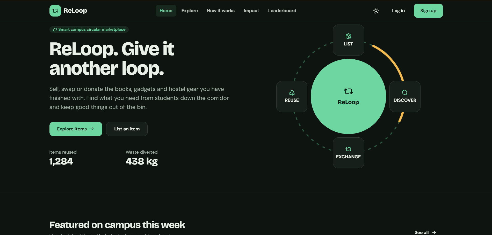

# ReLoop: Smart Campus Circular Marketplace

**"Give It Another Loop."**

ReLoop is a campus marketplace where students sell, swap, donate and reuse items they no longer need: books, calculators, electronics, cycles, furniture, clothing and more. It reduces campus waste, saves students money and makes the impact of reuse visible.


This is a frontend-only project. It uses React state, `localStorage` and mock data, so no backend or database is needed.

## Screenshots

| Home | Explore |
|---|---|
|  |  |

| Dashboard | Impact |
|---|---|
|  |  |

| Mobile | Dark mode |
|---|---|
|  |  |

## Features

- **10 pages:** Home, Explore, Item Details, Create Listing, Dashboard, Impact, Leaderboard, How It Works, Login and Sign Up
- **Explore:** live search, category chips, price / condition / location filters, 4 sort modes and favourites. Filters are stored in the URL so views can be shared.
- **Create Listing:** 7-step form with per-step validation (required fields, price including negatives, description length, location). Listings are saved to `localStorage`.
- **Dashboard:** stats, edit / delete / mark as exchanged, saved items, exchange requests (accept or decline), notifications, activity feed, points and badges
- **Impact:** three Recharts charts and a frontend-only impact calculator
- **Leaderboard:** Weekly, Monthly and All Time filters
- **Mock authentication:** form validation, Remember Me and protected routes
- **Light and dark mode** that persists, plus toasts, a reusable modal and a dropdown menu

## Demo account

```
Email:    demo@reloop.edu
Password: Reloop@123
```

You can also create your own account on the Sign Up page. Accounts are stored only in your browser.

## Tech stack

React 18, Vite 5, JavaScript, Tailwind CSS 3, React Router 6, Lucide React, Recharts (Impact page only, lazy-loaded), Vitest and React Testing Library.

## Project structure

```
src/
  components/   Layout (navbar, footer, toast), ListingCard, ItemArt, Modal, Field
  pages/        Home, Explore, ItemDetails, CreateListing, Dashboard,
                Impact, Leaderboard, HowItWorks, Auth (Login and SignUp)
  data/         mock.js: listings, leaderboard, FAQs, chart data
  hooks/        useApp (global state and persistence), useLocalStorage
  utils/        validation and impact helpers
  tests/        test setup and test suite
```

## Getting started

Requires **Node.js 18 or newer**.

```bash
git clone https://github.com/Priyansh252/ReLoop-Smart-Campus-Circular-Marketplace.git
cd  ReLoop-Smart-Campus-Circular-Marketplace
npm install
npm run dev
```

Open the local URL printed in the terminal (usually http://localhost:5173).

## Testing

```bash
npm test
```

11 tests (Vitest and React Testing Library) cover login validation, search, sorting, favourites, listing creation with validation, navigation, route protection and dark mode.

## Production build

```bash
npm run build
npm run preview
```

## Responsive design

Mobile-first layout using Tailwind utilities, designed for 375, 390, 430, 768, 1024, 1280 and 1440 px. The navigation becomes a menu below 1024 px, grids adapt from one to four columns, filters collapse on mobile and wide tables scroll inside their own container.

## Accessibility

Semantic landmarks and a skip link, labelled form controls with `aria-invalid` and `aria-describedby`, `role="alert"` errors, `aria-pressed` and `aria-expanded` states, keyboard-operable modal (Escape closes, focus returns), visible focus outlines, text alternatives for item pictures and charts, good contrast in both themes and reduced-motion support.

## Troubleshooting

| Problem | Fix |
|---|---|
| `npm` is not recognized | Install Node.js 18+ and reopen the terminal |
| Dependency errors | Delete `node_modules`, then run `npm install` again |
| Port already in use | `npm run dev -- --port 3000` |
| Fonts look different | Fonts load from Google Fonts. Offline, system fonts are used |

## AI tools used

This project was built with AI assistance, as allowed by the assignment.

- **Claude (Anthropic)** generated the React code, mock data, styling, tests and the first version of this README from a detailed written specification, and ran the install, test and build checks.
- **My contribution:** [Describe what you personally did, for example: wrote the specification, chose the theme and scope, reviewed and tested every page, made edits, captured screenshots and wrote the report.]

## Future improvements

Real backend and authentication, image uploads, in-app messaging between buyers and sellers, email notifications, campus single sign-on and map-based pick-up points.

## License

Released under the [MIT License](LICENSE).
